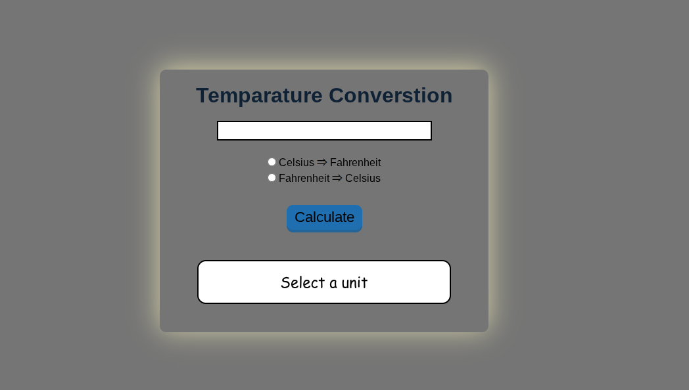

# 🌡️ Temperature Conversion Program

A simple JavaScript project to convert temperatures between **Celsius** and **Fahrenheit**.
##  📷 Preview
  

## 🌐 Live Demo
<a href='https://waris24w.github.io/temparature-converstion/'>Visit Here</a>

## 📌 Features
- Enter a temperature value in the input box.
- Choose the conversion direction:
  - Celsius ⇒ Fahrenheit
  - Fahrenheit ⇒ Celsius
- Display the result instantly on the page.
- Prevents form refresh to keep the result visible.

## 🛠️ Technologies Used
- **HTML** – Structure of the form and input fields.
- **CSS** – Basic styling (optional).
- **JavaScript** – Handles the conversion logic and DOM interactions.

## 📂 Project Structure
│── index.html  
│── style.css  
│── src.js  
│── README.md  
